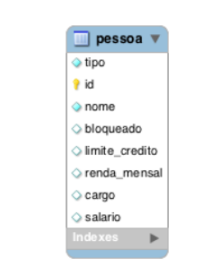
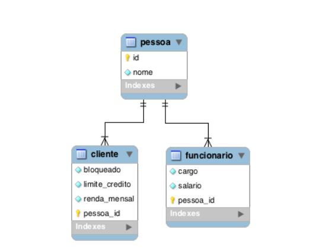
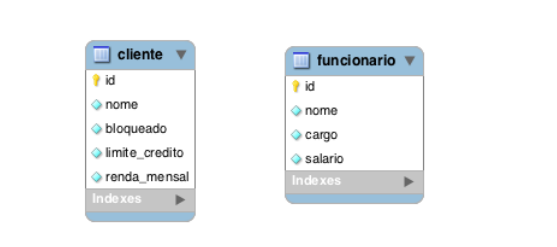

# heranca_jpa

## Herança

Mapear herança de classes que representam tabelas no banco de dados pode ser
uma tarefa complexa e nem sempre pode ser a melhor solução. Use este recurso
com moderação. Muitas vezes é melhor você mapear usando associações do que
herança.

A JPA define 3 formas de se fazer o mapeamento de herança:

• Tabela única para todas as classes (single table)
• Uma tabela para cada classe da hierarquia (joined)
• Uma tabela para cada classe concreta (table per class)

## Tabela única para todas as classes

Essa estratégia de mapeamento de herança é a melhor em termos de performance
e simplicidade, porém seu maior problema é que as colunas das propriedades
declaradas nas classes filhas precisam aceitar valores nulos. A falta da constraint
NOT NULL pode ser um problema sério no ponto de vista de integridade de
dados.

Para implementar essa estratégia, criaremos uma classe abstrata Pessoa.

@Entity
@Table(name = "pessoa")
@Inheritance(strategy = InheritanceType.SINGLE_TABLE)
@DiscriminatorColumn(name = "tipo")
public abstract class Pessoa {

    @Id
    @GeneratedValue(strategy = GenerationType.AUTO)
    private Long id;
    private String nome;

    public String getNome() {
        return nome;
    }

    public void setNome(String nome) {
        this.nome = nome;
    }

    @Override
    public boolean equals(Object o) {
        if (this == o) return true;
        if (o == null || getClass() != o.getClass()) return false;
        Pessoa pessoa = (Pessoa) o;
        return Objects.equals(id, pessoa.id);
    }

    @Override
    public int hashCode() {
        return Objects.hash(id);
    }
}

Definimos a estratégia SINGLE_TABLE com a anotação @Inheritance. Esse tipo de
herança é o padrão, ou seja, não precisaríamos anotar a classe com @Inheritance,
embora seja melhor deixar explícito para facilitar o entendimento.

A anotação @DiscriminatorColumn foi usada para informar o nome de coluna de
controle para discriminar de qual classe é o registro.

Agora, criaremos as subclasses Cliente e Funcionario.

@Entity
@DiscriminatorValue("C")
public class Cliente extends Pessoa {
private BigDecimal limiteCredito;
private BigDecimal rendaMensal;
private boolean bloqueado;
@Column(name = "limite_credito", nullable = true)
public BigDecimal getLimiteCredito() {
return limiteCredito;
}
public void setLimiteCredito(BigDecimal limiteCredito) {
this.limiteCredito = limiteCredito;
}
@Column(name = "renda_mensal", nullable = true)
public BigDecimal getRendaMensal() {
return rendaMensal;
}
public void setRendaMensal(BigDecimal rendaMensal) {
this.rendaMensal = rendaMensal;
}
@Column(nullable = true)
public boolean isBloqueado() {
return bloqueado;
}
public void setBloqueado(boolean bloqueado) {
this.bloqueado = bloqueado;
}
}

@Entity
@DiscriminatorValue("F")
public class Funcionario extends Pessoa {
private BigDecimal salario;
private String cargo;
@Column(nullable = true)
public BigDecimal getSalario() {
return salario;
}
public void setSalario(BigDecimal salario) {
this.salario = salario;
}
@Column(length = 60, nullable = true)
public String getCargo() {
return cargo;
}
public void setCargo(String cargo) {
this.cargo = cargo;
}
}

As subclasses foram anotadas com @DiscriminatorValue para definir o valor
discriminador de cada tipo.

Veja a única tabela criada, que armazena os dados de todas as subclasses.

Podemos persistir um cliente e um funcionário normalmente.
EntityManager manager = JpaUtil.getEntityManager();
EntityTransaction tx = manager.getTransaction();
tx.begin();

Funcionario funcionario = new Funcionario();
funcionario.setNome("Fernando");
funcionario.setCargo("Gerente");
funcionario.setSalario(new BigDecimal(12_000));

Cliente cliente = new Cliente();
cliente.setNome("Mariana");
cliente.setRendaMensal(new BigDecimal(8_500));
cliente.setLimiteCredito(new BigDecimal(2_000));
cliente.setBloqueado(true);

manager.persist(funcionario);
manager.persist(cliente);

tx.commit();
manager.close();
JpaUtil.close();

Veja na saída da execução do código acima que 2 inserts foram feitos.

Hibernate:
insert
into
pessoa
(nome, cargo, salario, tipo, id)
values
(?, ?, ?, 'F', ?)
Hibernate:
insert
into
pessoa
(nome, bloqueado, limite_credito, renda_mensal, tipo, id)
values
(?, ?, ?, ?, 'C', ?)

Repare que os valores discriminatórios F e C foram incluídos no comando de
inserção.

Podemos consultar apenas clientes ou funcionários, sem nenhuma novidade no
código.

Podemos consultar apenas clientes ou funcionários, sem nenhuma novidade no
código.

public static void main(String[] args) {

        EntityManager manager = JPAUtil.getEntityManager();

        List<Funcionario> funcionarios = manager.createQuery("from Funcionario",
                Funcionario.class).getResultList();
        for (Funcionario funcionario : funcionarios) {
            System.out.println(funcionario.getNome() + " - " + funcionario.getCargo()+" - "+funcionario.getSalario());
        }

        manager.close();
        JPAUtil.close();

    }
}

Hibernate:
select
funcionari0_.id as id2_0_,
funcionari0_.nome as nome3_0_,
funcionari0_.cargo as cargo7_0_,
funcionari0_.salario as salario8_0_
from
pessoa funcionari0_
where
funcionari0_.tipo='F'

Essa consulta gera um SQL com uma condição na cláusula where:

É possível também fazer uma consulta polimórfica de pessoas.

Operador instanceof no Java

O instanceof é um operador que permite testar se um objeto é uma instância de um 
tipo específico de uma classe, subclasse ou interface.

É possível também fazer uma consulta polimórfica de pessoas.
List<Pessoa> pessoas = manager.createQuery("from Pessoa",
Pessoa.class).getResultList();
for (Pessoa pessoa : pessoas) {
System.out.print(pessoa.getNome());
if (pessoa instanceof Cliente) {
System.out.println(" - é um cliente");
} else {
System.out.println(" - é um funcionário");
}
}

Essa consulta busca todas as pessoas (clientes e funcionários), executando a
consulta abaixo:
Hibernate:
select
pessoa0_.id as id2_0_,
pessoa0_.nome as nome3_0_,
pessoa0_.bloqueado as bloquead4_0_,
pessoa0_.limite_credito as limite_c5_0_,
pessoa0_.renda_mensal as renda_me6_0_,
pessoa0_.cargo as cargo7_0_,
pessoa0_.salario as salario8_0_,
pessoa0_.tipo as tipo1_0_
from
pessoa pessoa0_

## Uma tabela para cada classe da hierarquia

Outra forma de fazer herança é usar uma tabela para cada classe da hierarquia
(subclasses e superclasse).

Alteramos a estratégia de herança para JOINED na entidade Pessoa.

@Entity
@Table(name = "pessoa")
@Inheritance(strategy = InheritanceType.JOINED)
public abstract class Pessoa {
...
}
Nas classes Cliente e Funcionario, podemos adicionar a anotação
@PrimaryKeyJoinColumn para informar o nome da coluna que faz referência à
tabela pai, ou seja, o identificador de Pessoa. Se o nome dessa coluna for igual ao
nome da coluna da tabela pai, essa anotação não presisa ser utilizada.
@Entity
@Table(name = "funcionario")
@PrimaryKeyJoinColumn(name = "pessoa_id")
public class Funcionario extends Pessoa {
...
}
@Entity
@Table(name = "cliente")
@PrimaryKeyJoinColumn(name = "pessoa_id")
public class Cliente extends Pessoa {
...
}
Este tipo de mapeamento criará 3 tabelas.

Podemos persistir funcionários e clientes e depois executar uma pesquisa
polimórfica, para listar todas as pessoas. Veja a consulta SQL usada:

Hibernate:
select
pessoa0_.id as id1_2_,
pessoa0_.nome as nome2_2_,
pessoa0_1_.bloqueado as bloquead1_0_,
pessoa0_1_.limite_credito as limite_c2_0_,
pessoa0_1_.renda_mensal as renda_me3_0_,
pessoa0_2_.cargo as cargo1_1_,
pessoa0_2_.salario as salario2_1_,
case
when pessoa0_1_.pessoa_id is not null then 1
when pessoa0_2_.pessoa_id is not null then 2
when pessoa0_.id is not null then 0
end as clazz_
from
pessoa pessoa0_
left outer join
cliente pessoa0_1_
on pessoa0_.id=pessoa0_1_.pessoa_id
left outer join

funcionario pessoa0_2_
on pessoa0_.id=pessoa0_2_.pessoa_id

O Hibernate usou left outer join para relacionar a tabela pai às tabelas filhas e
também fez um case para controlar de qual tabela/classe pertence o registro.

Uma tabela para cada classe concreta

Uma outra opção de mapeamento de herança é ter tabelas apenas para classes
concretas (subclasses). Cada tabela deve possuir todas as colunas, incluindo as da
superclasse.

Para utilizar essa forma de mapeamento, devemos anotar a classe Pessoa da
maneira apresentada abaixo:

@Entity
@Inheritance(strategy = InheritanceType.TABLE_PER_CLASS)
public abstract class Pessoa {
private Long id;
private String nome;
@Id
@GeneratedValue(generator = "inc")
@GenericGenerator(name = "inc", strategy = "increment")
public Long getId() {
return id;
}
...
}

Tivemos que mudar a estratégia de geração de identificadores. Não podemos
usar a geração automática de chaves nativa do banco de dados.

Veja a estrutura das tabelas criadas:

Agora, a consulta polimórfica por objetos do tipo Pessoa gera a seguinte consulta:

Hibernate:
select
pessoa0_.id as id1_0_,
pessoa0_.nome as nome2_0_,
pessoa0_.bloqueado as bloquead1_1_,
pessoa0_.limite_credito as limite_c2_1_,
pessoa0_.renda_mensal as renda_me3_1_,
pessoa0_.cargo as cargo1_2_,
pessoa0_.salario as salario2_2_,
pessoa0_.clazz_ as clazz_
from
( select
id,
nome,
bloqueado,
limite_credito,
renda_mensal,
null as cargo,
null as salario,
1 as clazz_
from
cliente
union
select
id,
nome,
null as bloqueado,
null as limite_credito,
null as renda_mensal,
cargo,

salario,
2 as clazz_
from
funcionario
) pessoa0_

## Herança de propriedades da superclasse

Pode ser útil, em algumas situações, compartilhar propriedades através de uma
superclasse, sem considerá-la como uma entidade mapeada. Para isso, podemos
usar a anotação @MappedSuperclass.

@MappedSuperclass
public abstract class Pessoa {
private Long id;
private String nome;
@Id
@GeneratedValue
public Long getId() {
return id;
}
....
}

As subclasses são mapeadas normalmente, sem nada especial:

@Entity
@Table(name = "cliente")
public class Cliente extends Pessoa {
...
}

@Entity
@Table(name = "funcionario")
public class Funcionario extends Pessoa {
...
}

Apenas as tabelas cliente e funcionario serão criadas. Como esse tipo de
mapeamento não é uma estratégia de herança da JPA, não conseguimos fazer
uma consulta polimórfica. Veja a mensagem de erro se tentarmos isso:

Caused by: org.hibernate.hql.internal.ast.QuerySyntaxException:
Pessoa is not mapped [from Pessoa]

## Modos de acesso

O estado das entidades precisam ser acessíveis em tempo de execução pelo
provedor JPA, para poder ler e alterar os valores e sincronizar com o banco de
dados.

Existem duas formas de acesso ao estado de uma entidade: field access e property
access.

## Field access

Se anotarmos os atributos de uma entidade, o provedor JPA irá usar o modo field
access para obter e atribuir o estado da entidade. Os métodos getters e setters não
são obrigatórios, neste caso, mas caso eles existam, serão ignorado pelo provedor
JPA.

É recomendado que os atributos tenham o modificador de acesso protegido,
privado ou padrão. O modificador público não é recomendado, pois expõe
demais os atributos para qualquer outra classe.

No exemplo abaixo, mapeamos a entidade Tarefa usando field access.

@Entity
@Table(name = "tarefa")
public class Tarefa {
@Id
@GeneratedValue
private Long id;
@Column(length = 100, nullable = false)
private String descricao;
@Temporal(TemporalType.TIMESTAMP)
@Column(nullable = false)
private Date dataLimite;
public Long getId() {
return id;
}
public void setId(Long id) {
this.id = id;
}
public String getDescricao() {
return descricao;
}
public void setDescricao(String descricao) {
this.descricao = descricao;
}
public Date getDataLimite() {
return dataLimite;
}
public void setDataLimite(Date dataLimite) {
this.dataLimite = dataLimite;
}
// hashCode e equals
}

Quando a anotação @Id é colocada no atributo, fica automaticamente definido
que o modo de acesso é pelos atributos (field access).

## Property access

Quando queremos usar o acesso pelas propriedades da entidade (property access),
devemos fazer o mapeamento nos métodos getters, como fizemos nos exemplos
das seções anteriores. Neste caso, é obrigatório que existam os métodos getters e
setters, pois o acesso aos atributos é feito por eles.

Veja a mesma entidade Tarefa mapeada com property access.

@Entity
@Table(name = "tarefa")
public class Tarefa {
private Long id;
private String descricao;
private Date dataLimite;
@Id
@GeneratedValue
public Long getId() {
return id;
}
public void setId(Long id) {
this.id = id;
}
@Column(length = 100, nullable = false)
public String getDescricao() {
return descricao;
}
public void setDescricao(String descricao) {
this.descricao = descricao;
}
@Temporal(TemporalType.TIMESTAMP)
@Column(nullable = false)
public Date getDataLimite() {
return dataLimite;
}

public void setDataLimite(Date dataLimite) {
this.dataLimite = dataLimite;
}
// hashCode e equals
}

